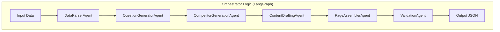

# Architecture Documentation

## Overview
This project uses **LangChain** and **LangGraph** to orchestrate a team of AI agents for content generation. The system is designed to be modular, scalable, and fully model-driven.

## Core Components

### 1. Orchestrator (`src/core/orchestration.py`)
- Implements a `StateGraph` using `langgraph`.
- Manages the flow of data between agents.
- Maintains the global `AgentState`.

### 2. State (`src/core/state.py`)
- Defines the shared data structure passed between nodes.
- Includes `input_data`, `product_model`, `questions`, `competitor_data`, `content_blocks`, and `final_pages`.

### 3. Agents (`src/agents/`)
Each agent is a specialized component that uses an LLM (Google Gemini) via LangChain.

- **DataParserAgent**: Cleans and structures raw input into a strict Pydantic model (`ProductSchema`).
- **QuestionGeneratorAgent**: Generates relevant FAQs based on product details.
- **CompetitorGenerationAgent**: Creates a fictional competitor profile for comparison.
- **ContentDraftingAgent**: Writes marketing copy and comparison tables.
- **PageAssemblerAgent**: Combines all outputs into the final JSON structure.
- **ValidationAgent**: Critiques the final output for compliance and quality.

## Data Flow

## Configuration
- **Model**: Google Gemini 2.5 Flash (`gemini-2.5-flash`).
- **Frameworks**: LangChain, LangGraph.
- **Env**: Requires `GOOGLE_API_KEY` in `.env` or environment variables.
